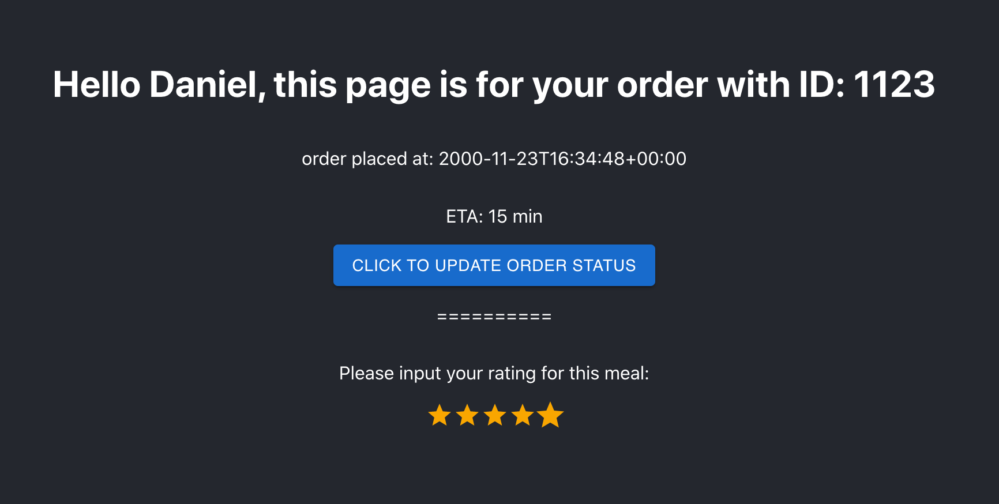

# Kue-Web

Web Component of [Kue](https://github.com/YingjieQiao/kue).

Built with React for frontend and Flask for backend, hosted on an AWS EC2 server instance.




## Build Setup

``` bash
# install frontend dependencies
cd frontend
npm install

# serve with hot reload at localhost:3000
npm run start

# build for production with minification
npm run build


# install backend dependencies
cd ../backend
pip install -r requirements.txt

# serve backend at localhost:5000
FLASK_APP=run.py flask run
```

